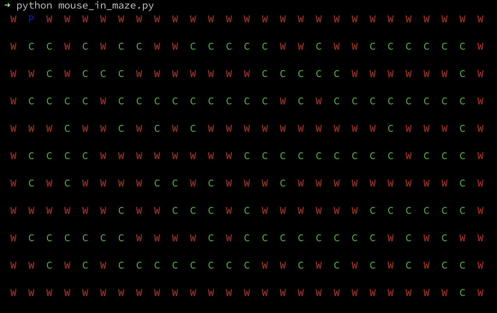
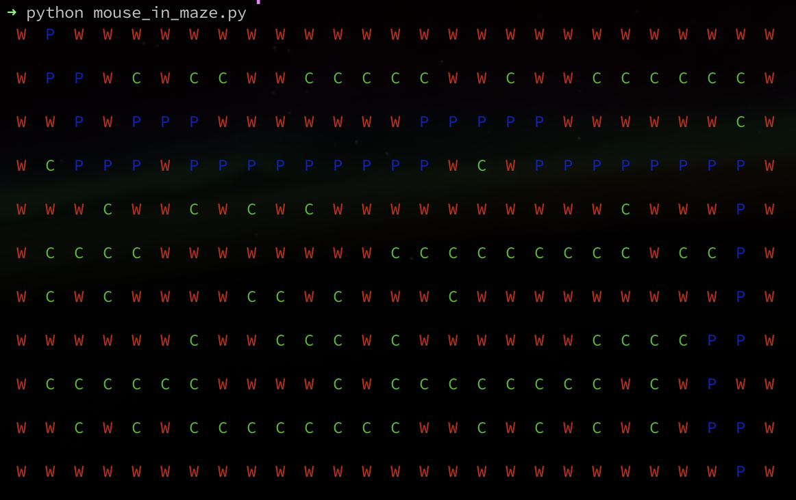

# Mouse in a Maze

Bienvenue dans le projet "Mouse in a Maze"! Ce projet est une introduction à la programmation en Python. Vous allez interagir avec du code existant pour compléter certaines parties et apprendre les bases de la programmation en Python.

## Prérequis

Pour réaliser ce projet, vous aurez besoin des éléments suivants :

- Python 3
- La librairie `colorama`
- Visual Studio Code

Vous pouvez utiliser Windows ou Linux pour ce projet.

## Installation

Si c'est la première fois que vous vous lancez dans le code, ou si vous avez besoin d'un petit rafraichissement de mémoire, voici quelques informations
qui pourront vous être utiles:

- `Visual Studio Code` est ce qu'on appel un éditeur de texte. C'est un outil parmis d'autres que les développeurs utilisent quotidiennement pour écrire leur code.
- `Python` C'est le langage de programmation que l'on va utiliser pour ce projet! Il en existe une multitude, mais nous avons choisi python pour
sa simplicité et son efficacité pour écrire des scripts!
- `Colorama` est une librairie, autrement dit du code qu'une ou généralement plusieurs autre personnes ont gentillement partagé pour nous éviter de réinventer la roue ;) Elle va nous permettre de produire des sorties colorées dans le terminal.

### Windows

1. **Installer Python 3**  
   Téléchargez et installez Python 3 depuis le site officiel : [python.org](https://www.python.org/downloads/).

2. **Installer Visual Studio Code**  
   Téléchargez et installez Visual Studio Code depuis le site officiel : [code.visualstudio.com](https://code.visualstudio.com/).

3. **Installer la librairie `colorama`**  
   Ouvrez une invite de commande (cmd) et exécutez la commande suivante :
   ```bash
   pip install colorama

### Linux

1. **Installer Python 3**  
   Ouvrez un terminal et exécutez les commandes suivantes
   ```bash
   sudo apt-get update
   sudo apt-get install python3
   ```

2. **Installer Visual Studio Code**  
   Suivez les instructions pour installer Visual Studio Code depuis le site officiel : [code.visualstudio.com](https://code.visualstudio.com/).

3. **Installer la librairie `colorama`**  
   Ouvrez un terminal et exécutez la commande suivante :
   ```bash
   pip install colorama
   ```

## Le Projet

### Step 1

Complétez la section `Installation` avant d'aller à la step2! Si vous rencontrez un problème, n'hésitez pas à demander de l'aide à l'équipe du coding club ou autour de vous!

Pour vérifier que l'installation s'est bien déroulée, tentez de lancer le programme avec la commande suivante:

```bash
python3 mouse_in_a_maze.py
```

## Step 2

Complétez la fonction `print_maze` pour qu'elle affiche correctement le labyrinthe, ça nous sera utile pour la suite ;)

L'affichage doit être le suivant:



## Step 3

Maintenant qu'on peut visualiser notre labyrinthe, il nous reste à le résoudre et aider notre souris à s'évader!

Une solution possible peut être la suivante:

